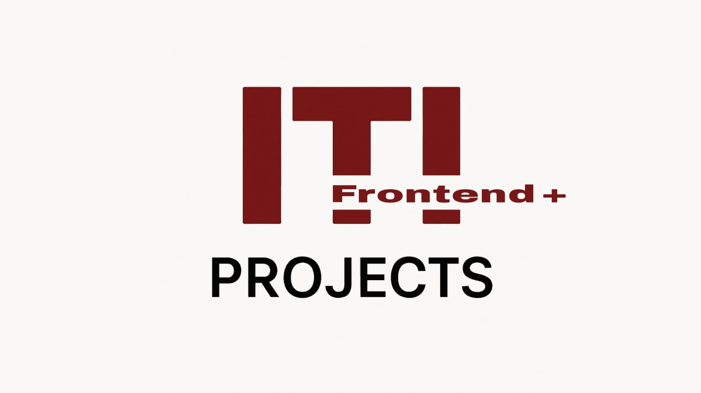

# ITI Professional Accelerator Projects 🚀

A curated collection of hands-on projects completed during the **ITI Professional Accelerator** program, demonstrating technical proficiency in modern web technologies.

This website showcases a variety of front-end projects built with **HTML**, **CSS**, and **Vanilla JavaScript**, focusing on practical skills such as DOM manipulation, event handling, API integration, and UI functionality.

---

## 🖼️ UI Preview

---

## 🚀 Demo

🔗 [Live Demo](https://3bdulrahmn69.github.io/iti-projects-zag-branch-r3/)

---

## 🌟 Featured Projects

### 🎮 Game Center

A collection of browser games developed using vanilla JavaScript. This project helped build a strong understanding of DOM manipulation, events, and dynamic interfaces.

- 🧠 Focus: JavaScript logic, DOM events, UI updates
- 💡 Tech: HTML, CSS, JavaScript
- 🔗 [Live Demo](https://3bdulrahmn69.github.io/iti-games-tasks) | [Source Code](https://github.com/3bdulrahmn69/iti-games-tasks)

---

### 📺 JavaScript Video Player

A custom-built video player with all the essential media controls including play/pause, volume, fullscreen, and keyboard shortcuts.

- 🎯 Focus: Media control APIs, custom controls, UX
- 💡 Tech: HTML, CSS, JavaScript
- 🔗 [Live Demo](https://3bdulrahmn69.github.io/js-video-player) | [Source Code](https://github.com/3bdulrahmn69/js-video-player)

---

### ☁️ Weather App

A responsive weather application that uses [weatherapi.com](https://www.weatherapi.com) to fetch and display real-time weather data.

- 📍 Features: Location-based search, current weather, 7-day forecast
- 💡 Tech: HTML, CSS, JavaScript, Weather API
- 🔗 [Live Demo](https://3bdulrahmn69.github.io/weather-app-iti) | [Source Code](https://github.com/3bdulrahmn69/weather-app-iti)

---

> 📌 **More projects coming soon!** Stay tuned as I continue expanding this collection with new and exciting builds.

## 📂 Explore More Projects

Looking for more? Visit the full portfolio to discover additional projects, tools, and case studies.

➡️ **[View Full Portfolio](https://3bdulrahmn.vercel.app/)**

---

## 🌐 Connect With Me

- **GitHub:** [@3bdulrahmn69](https://github.com/3bdulrahmn69)
- **LinkedIn:** [@3bdulrahmn69](https://www.linkedin.com/in/3bdulrahmn69)

---

© 2025 Abdulrahman Moussa. All rights reserved.
